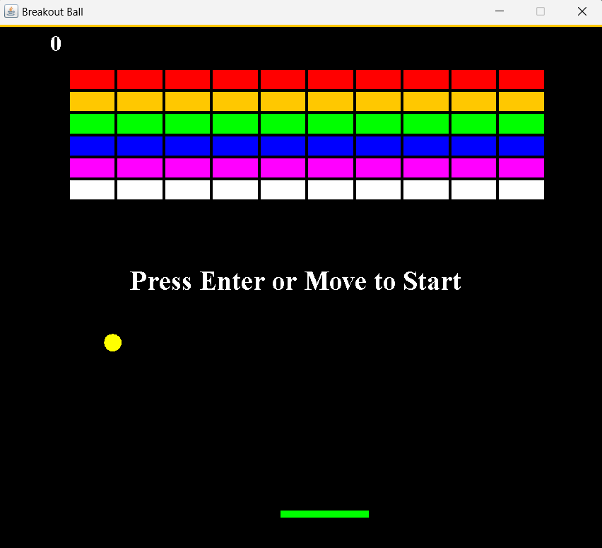

# Brick Breaker Game

This is a simple implementation of the classic Brick Breaker game in Java. The game is built using Java Swing for the GUI.

## Description

The game starts with a set of bricks that the player needs to break using a ball. The player controls a paddle that can move left or right to bounce the ball and prevent it from falling off the screen. The game ends when all bricks are broken (win) or the ball falls off the screen (lose).

## Gameplay

Here's a GIF showing the gameplay:

## How to Run

1. Compile the Java files in the `src/` directory.
2. Run the `Main` class.

## Code Structure

- `GamePlay.java`: This class contains the game logic, including the ball movement, collision detection, and game state management.
- `Main.java`: This class sets up the game window and starts the game.
- `MapGenerator.java`: This class is responsible for generating the bricks.